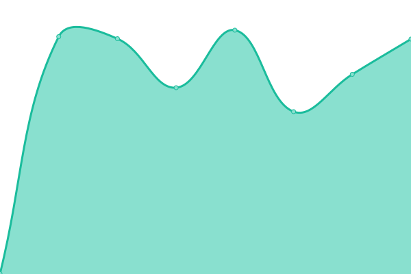
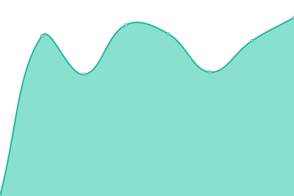
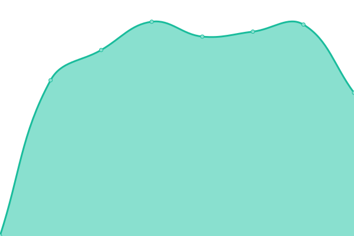
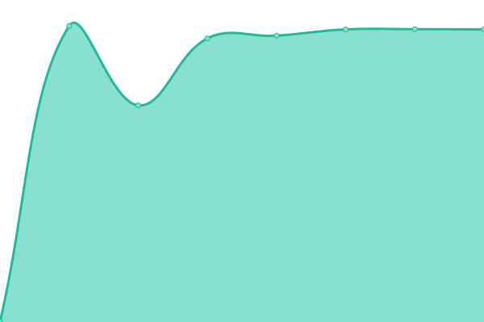
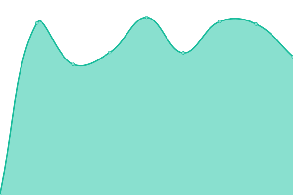
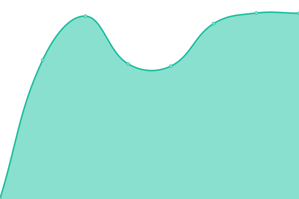
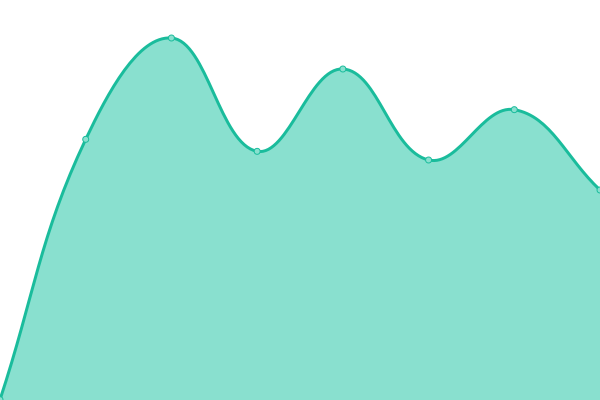
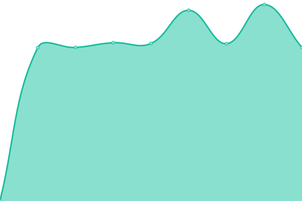
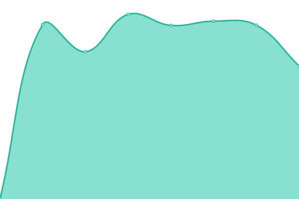

# [📈 Live Status](https://JayRovacsek.github.io/uptime): <!--live status--> **🟩 All systems operational**

<!--start: status pages-->
<!-- This summary is generated by Upptime (https://github.com/upptime/upptime) -->
<!-- Do not edit this manually, your changes will be overwritten -->
<!-- prettier-ignore -->
| URL | Status | History | Response Time | Uptime |
| --- | ------ | ------- | ------------- | ------ |
|  [Authelia](https://authelia.rovacsek.com) | 🟩 Up | [authelia.yml](https://github.com/JayRovacsek/uptime/commits/HEAD/history/authelia.yml) | 

 586ms
     
 | 

<a href="https://JayRovacsek.github.io/uptime/history/authelia">100.00%</a>
    

|  [Deluge](https://deluge.rovacsek.com) | 🟩 Up | [deluge.yml](https://github.com/JayRovacsek/uptime/commits/HEAD/history/deluge.yml) | 

 751ms
     
 | 

<a href="https://JayRovacsek.github.io/uptime/history/deluge">100.00%</a>
    

|  [Firefox-Syncserver](https://firefox-syncserver.rovacsek.com) | 🟩 Up | [firefox-syncserver.yml](https://github.com/JayRovacsek/uptime/commits/HEAD/history/firefox-syncserver.yml) | 

 734ms
     
 | 

<a href="https://JayRovacsek.github.io/uptime/history/firefox-syncserver">100.00%</a>
    

|  [Grafana](https://grafana.rovacsek.com) | 🟩 Up | [grafana.yml](https://github.com/JayRovacsek/uptime/commits/HEAD/history/grafana.yml) | 

 746ms
     
 | 

<a href="https://JayRovacsek.github.io/uptime/history/grafana">100.00%</a>
    

|  [Headscale](https://headscale.rovacsek.com/windows) | 🟩 Up | [headscale.yml](https://github.com/JayRovacsek/uptime/commits/HEAD/history/headscale.yml) | 

 583ms
     
 | 

<a href="https://JayRovacsek.github.io/uptime/history/headscale">100.00%</a>
    

|  [Hydra](https://hydra.rovacsek.com) | 🟩 Up | [hydra.yml](https://github.com/JayRovacsek/uptime/commits/HEAD/history/hydra.yml) | 

 626ms
     
 | 

<a href="https://JayRovacsek.github.io/uptime/history/hydra">100.00%</a>
    

|  [Jellyfin](https://jellyfin.rovacsek.com) | 🟩 Up | [jellyfin.yml](https://github.com/JayRovacsek/uptime/commits/HEAD/history/jellyfin.yml) | 

 745ms
     
 | 

<a href="https://JayRovacsek.github.io/uptime/history/jellyfin">100.00%</a>
    

|  [Jellyseerr](https://jellyseerr.rovacsek.com) | 🟩 Up | [jellyseerr.yml](https://github.com/JayRovacsek/uptime/commits/HEAD/history/jellyseerr.yml) | 

 1540ms
     
 | 

<a href="https://JayRovacsek.github.io/uptime/history/jellyseerr">100.00%</a>
    

|  [Lidarr](https://lidarr.rovacsek.com) | 🟩 Up | [lidarr.yml](https://github.com/JayRovacsek/uptime/commits/HEAD/history/lidarr.yml) | 

 1114ms
     
 | 

<a href="https://JayRovacsek.github.io/uptime/history/lidarr">100.00%</a>
    

|  [Nextcloud](https://nextcloud.rovacsek.com) | 🟩 Up | [nextcloud.yml](https://github.com/JayRovacsek/uptime/commits/HEAD/history/nextcloud.yml) | 

 1539ms
     
 | 

<a href="https://JayRovacsek.github.io/uptime/history/nextcloud">100.00%</a>
    

|  [Pfsense](https://pfsense.rovacsek.com) | 🟩 Up | [pfsense.yml](https://github.com/JayRovacsek/uptime/commits/HEAD/history/pfsense.yml) | 

 743ms
     
 | 

<a href="https://JayRovacsek.github.io/uptime/history/pfsense">100.00%</a>
    

|  [Prowlarr](https://prowlarr.rovacsek.com) | 🟩 Up | [prowlarr.yml](https://github.com/JayRovacsek/uptime/commits/HEAD/history/prowlarr.yml) | 

 728ms
     
 | 

<a href="https://JayRovacsek.github.io/uptime/history/prowlarr">100.00%</a>
    

|  [Radarr](https://radarr.rovacsek.com) | 🟩 Up | [radarr.yml](https://github.com/JayRovacsek/uptime/commits/HEAD/history/radarr.yml) | 

 712ms
     
 | 

<a href="https://JayRovacsek.github.io/uptime/history/radarr">100.00%</a>
    

|  [Sonarr](https://sonarr.rovacsek.com) | 🟩 Up | [sonarr.yml](https://github.com/JayRovacsek/uptime/commits/HEAD/history/sonarr.yml) | 

 721ms
     
 | 

<a href="https://JayRovacsek.github.io/uptime/history/sonarr">100.00%</a>
    

|  [Unifi](https://unifi.rovacsek.com) | 🟩 Up | [unifi.yml](https://github.com/JayRovacsek/uptime/commits/HEAD/history/unifi.yml) | 

 722ms
     
 | 

<a href="https://JayRovacsek.github.io/uptime/history/unifi">100.00%</a>
    

<!--end: status pages-->

[**Visit the status website →**](https://JayRovacsek.github.io/uptime)
